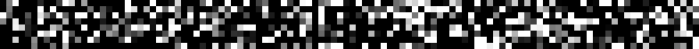
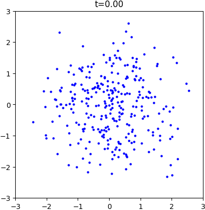
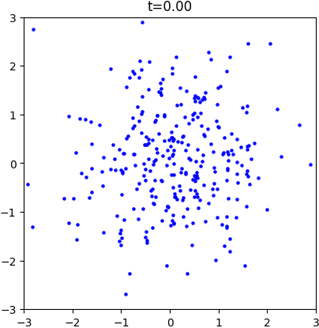
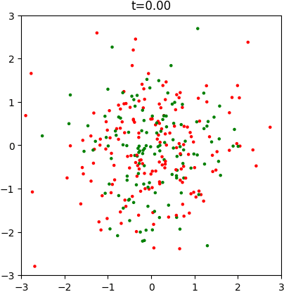
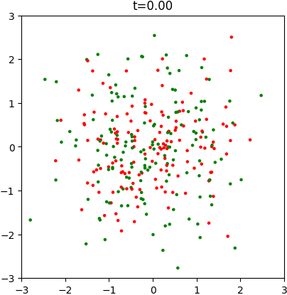
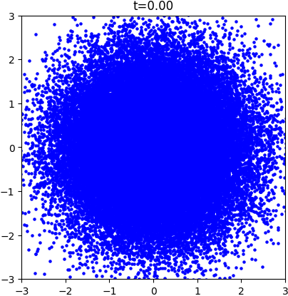
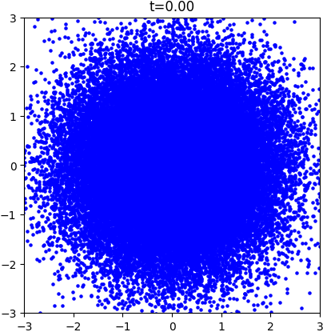

<div align="center">



[](https://colab.research.google.com/drive/1bY2Awyat0q_bubYDEo9xoRnkGf40dgHp?usp=sharing)
[](https://github.com/facebookresearch/flow_matching)
[](https://pytorch.org/get-started/locally/)

</div>

## Introduction

This is a **minimal course and experimentation playground** for learning **generative flow models**. The goal is to focus on **explicit training loops and small-scale experiments**, rather than relying on large frameworks. This approach helps reveal more clearly how generative models work internally. The provided code is largely **self-contained**, and it should remain so when answering the questions in this lab. The codebase is intended to serve as a **foundation on which new functionalities can be built**. Before diving into the exercises, we briefly explain what the code is doing.

### Basics of Flow Matching

Flow matching belongs to a class of **continuous-time generative models** that learn how to transform a simple probability distribution (typically Gaussian noise) into the distribution of real data. Let:

- $x_0$ be a sample from a simple distribution (e.g., Gaussian noise),
- $x_1$ be a sample from the data distribution,
- $t \in [0,1]$ be a time parameter.

We consider a trajectory connecting $x_0$ and $x_1$, and denote the point along this path at time $t$ by $x_t$. The key idea is to train a neural network that, given a point $x_t$ at time $t$, predicts a quantity that allows us to infer the next point $x_{t+{1}/{T}}$ on the trajectory. By iterating this procedure, the sample gradually moves from noise toward the data distribution until $t=1$, where it resembles a sample drawn from the dataset. This process can be interpreted as the numerical integration of an ordinary differential equation (ODE), where the model explicitly or implicitly defines the flow field guiding the trajectory.

### Training Pipeline

The provided code implements the full pipeline for training such a flow model. Both the datasets and the models are intentionally **small-scale**, allowing training to run quickly on standard hardware. Two training methods are implemented:

- **Rectified Flow** (default)
- **DDIM (Denoising Diffusion Implicit Models)**, enabled with the flag `--DDIM`.

| Method | Trajectory | Loss |
|------|------|------|
| **DDIM** | $$x_t = \sqrt{\alpha(1-t)} \cdot x_1 + \sqrt{1 - \alpha(1-t)} \cdot x_0$$ | $$\text{MSE}\big(x_0 - \text{model}(x_t,t)\big)$$ |
| **Rectified Flow** | $$x_t = t \cdot x_1 + (1 - t) \cdot x_0$$ | $$\text{MSE}\big(x_1 - x_0 - \text{model}(x_t,t)\big)$$ |

For **DDIM**, the noise schedule is defined as $T(t) \triangleq 0.1 \cdot t + 19.9 \cdot t^2/2$ and $\alpha(t) \triangleq \exp\left(-T(t)/2\right).$

### Trajectory Sampling During Inference

The model also provides a way to **sample the full trajectory of the generative process during inference**. Starting from a random noise sample $x_0$, the model iteratively updates the sample. This corresponds to **numerically integrating the learned differential equation**. By default, the integration uses **Euler's method**, which is simple and efficient.

#### DDIM

```python
x = torch.randn(x_shape)
for t in torch.linspace(0, 1 - 1 / T, T):
    x0 = model(x, t)
    x1 = (x - torch.sqrt(1 - alpha(1 - t)) * x0) / torch.sqrt(alpha(1 - t))
    x = torch.sqrt(alpha(1 - t - 1/T)) * x1 + torch.sqrt(1 - alpha(1 - t - 1/T)) * x0
```

#### Rectified Flow

```python
x = torch.randn(x_shape)
for t in torch.linspace(0, 1 - 1 / T, T):
    v = model(x, t)
    x = x + v / T
```

### Conditional Models

Using the `--conditional` flag, the model can optionally be **conditioned on the label of each data sample**.

- **Unconditional flows** learn the overall data distribution without any additional information.
- **Conditional flows** learn the distribution **conditioned on a label**, allowing the model to generate samples corresponding to specific classes.

In practice, this means the model receives both the sample $x_t$, the time $t$, and the **class label** as inputs during training and inference.

## Questions

### 1. Run the following experiments and compare Rectified Flow and DDIM.
#### Two moons
```bash
# Rectified Flow
python train.py
python sample.py --gif

# DDIM
python train.py --DDIM
python sample.py --checkpoint output/TwoMoons_ddim.pth  --gif

# Conditional Rectified Flow
python train.py --conditional
python sample.py --checkpoint output/TwoMoons_cond.pth  --gif

# Conditional DDIM
python train.py --conditional --DDIM
python sample.py --checkpoint output/TwoMoons_cond_ddim.pth  --gif
```

<table>
  <tr>
    <td align="center">
      <br>
      <b>Rectified Flow</b>
    </td>
    <td align="center">
      <br>
      <b>DDIM</b>
    </td>
    <td align="center">
      <br>
      <b>Conditional Rectified Flow</b>
    </td>
    <td align="center">
      <br>
      <b>Conditional DDIM</b>
    </td>
  </tr>
</table>

#### Chessboard
```bash
# Rectified Flow
python train.py --dataset "ChessBoard" --model_config '{"model" : "MLP", "h" : 512}' --lr 1e-3
python sample.py --n_samples 50000 --model_config '{"model" : "MLP", "h" : 512}' --checkpoint output/ChessBoard.pth  --gif

# DDIM
python train.py --dataset "ChessBoard" --DDIM --model_config '{"model" : "MLP", "h" : 512}' --lr 1e-3
python sample.py --n_samples 50000 --model_config '{"model" : "MLP", "h" : 512}' --checkpoint output/ChessBoard_ddim.pth  --gif

# Conditional Rectified Flow
python train.py --dataset "ChessBoard" --model_config '{"model" : "MLP", "h" : 512}' --lr 1e-3 --conditional
python sample.py --n_samples 50000 --model_config '{"model" : "MLP", "h" : 512}' --checkpoint output/ChessBoard_cond.pth  --gif

# Conditional DDIM
python train.py --dataset "ChessBoard" --model_config '{"model" : "MLP", "h" : 512}' --lr 1e-3 --conditional --DDIM
python sample.py --n_samples 50000 --model_config '{"model" : "MLP", "h" : 512}' --checkpoint output/ChessBoard_cond_ddim.pth  --gif
```

<table>
  <tr>
    <td align="center">
      <br>
      <b>Rectified Flow</b>
    </td>
    <td align="center">
      <br>
      <b>DDIM</b>
    </td>
    <td align="center">
      <br>
      <b>Conditional Rectified Flow</b>
    </td>
    <td align="center">
      <br>
      <b>Conditional DDIM</b>
    </td>
  </tr>
</table>

#### MNIST

```bash
# Rectified Flow
python train.py --dataset "MNIST" --model_config '{"model" : "UNet"}' --lr 1e-3 --batch_size=256
python sample.py --n_samples 16 --model_config '{"model" : "UNet"}' --checkpoint output/MNIST.pth  --gif

# DDIM
python train.py --dataset "MNIST" --model_config '{"model" : "UNet"}' --lr 1e-3 --batch_size=256 --DDIM
python sample.py --n_samples 16 --model_config '{"model" : "UNet"}' --checkpoint output/MNIST_ddim.pth  --gif

# Conditional Rectified Flow
python train.py --dataset "MNIST" --model_config '{"model" : "UNet"}' --lr 1e-3 --batch_size=256 --conditional
python sample.py --n_samples 16 --model_config '{"model" : "UNet"}' --checkpoint output/MNIST_cond.pth  --gif

# Conditional DDIM
python train.py --dataset "MNIST" --model_config '{"model" : "UNet"}' --lr 1e-3 --batch_size=256 --conditional --DDIM
python sample.py --n_samples 16 --model_config '{"model" : "UNet"}' --checkpoint output/MNIST_cond_ddim.pth  --gif
```

<table>
  <tr>
    <td align="center">
      <br>
      <b>Rectified Flow</b>
    </td>
    <td align="center">
      <br>
      <b>DDIM</b>
    </td>
    <td align="center">
      <br>
      <b>Conditional Rectified Flow</b>
    </td>
    <td align="center">
      <br>
      <b>Conditional DDIM</b>
    </td>
  </tr>
</table>

### 2. Implement **Discrete Flow Matching** on the MNIST dataset by first **binarizing the images** (set each pixel to 1 if `img > 0.5`, otherwise 0), so that the data distribution becomes a **pixel-wise binary distribution**.

### 3. Implement **Image Editing** by ODE Inversion: start from an existing MNIST image, run the generative process backward to map the image to the latent noise space, and then regenerate an image from that noise but with a different conditional label.
